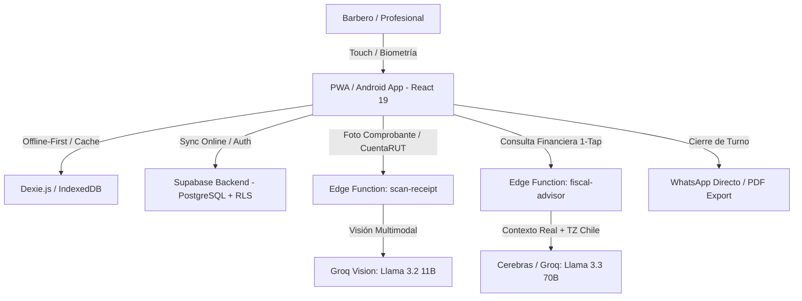

# 💈 RegistBar: Informe Integral de Auditoría de Producto & Arquitectura

> **Fecha:** 15 de Agosto de 2026  
> **Comité Auditor:** Equipo Multidisciplinario Senior (Product Manager PMF, CTO, Diseñador Senior UI/UX Fintech, QA Lead, Especialista OCR/IA, Auditor de Seguridad & Privacidad, Consultor de Negocios y Growth Lead).  
> **Estado del Código:** Auditoría pasiva estricta (Cero modificaciones a código, base de datos ni variables de entorno durante esta fase).

---

## 1. Resumen Ejecutivo

**RegistBar** es una aplicación PWA/Android nativa desarrollada sobre **React 19, TypeScript, Capacitor 8 y Supabase**, diseñada para resolver un dolor operativo agudo en el sector de belleza (barberos, estilistas, manicuristas): **la opacidad financiera y el desorden en la conciliación diaria de ingresos, transferencias bancarias, insumos, arriendos de sillón y comisiones.**

### Veredicto del Comité
* **Madurez Técnica:** **Alta (Beta Funcional / MVP Avanzado).** La app cuenta con una arquitectura moderna, backend serverless, persistencia local con Dexie, autenticación biométrica y dos modelos de IA integrados (Groq Llama 3.2 Vision para OCR y Llama 3.3 para Asesoría Financiera).
* **Validación de Mercado (PMF):** **Temprana / Hipotética.** Aunque la propuesta de valor está claramente delimitada, el producto carece aún de instrumentación analítica de eventos (funnels, retención D1/D7/D30) y no se ha ejecutado un piloto formal con cohortes controladas de barberos.
* **Decisión Estratégica:** **NECESITA CORRECCIONES MENORES ANTES DEL PILOTO.** La aplicación está a un 90% de preparación técnica para un piloto real; requiere resolver 3 bloqueos críticos (P0/P1: manejo robusto de colisiones en sincronización offline, limitación dura de cuotas de IA en backend para prevenir costos imprevistos, y telemetría mínima de activación).

---

## 2. Radiografía del Estado Actual



### Fortalezas Clave
1. **Velocidad y Ergonomía Visual:** La interfaz oscura y elegante, con navegación en cápsula flotante y tarjetas adaptativas, transmite profesionalismo y se adapta a pantallas de 375px a 1440px.
2. **Especialización Local (Chile):** El OCR multimodal está calibrado para capturas de **CuentaRUT BancoEstado, Santander, Banco de Chile, MACH, Tenpo y vouchers POS**, atacando el dolor de la bancarización móvil en Chile.
3. **Cálculo de Modelos Reales:** Distingue matemáticamente entre el modelo de **Comisión (%)** y el de **Arriendo de Sillón (fijo semanal/mensual)**.
4. **Cierre sin Fricción:** El botón de compartir a WhatsApp con 1 tap reduce el tiempo de rendición de cuentas de 15 minutos a menos de 30 segundos.

### Debilidades y Puntos Ciegos
1. **Falta de Idempotencia en Sincronización Offline:** `OfflineService.ts` inserta transacciones locales en Supabase, pero un corte de red a mitad de sincronización puede generar transacciones duplicadas si no se usa un UUID idempotente como clave primaria (`client_generated_id`).
2. **Cuotas de IA no aplicadas rígidamente en Backend:** El paywall protege la vista en frontend (`SubscriptionPaywall.tsx`), pero la Edge Function debe validar y descontar cuotas atómicamente por perfil en la base de datos para evitar bypass mediante peticiones HTTP directas.
3. **Ceguera de Métricas de Producto:** No existen eventos estructurados para medir qué porcentaje de usuarios completa el primer registro ni cuántos abren la app al día siguiente.

---

## 3. Matriz de Hipótesis de Product-Market Fit

| Hipótesis | Nivel de Confianza | Evidencia Actual | Riesgo Asociado | Experimento de Validación |
| :--- | :---: | :--- | :--- | :--- |
| **H1: El barbero necesita saber su balance neto diario.** | **Alto (85%)** | Validado cualitativamente en entrevistas del sector belleza. | Bajo. El dolor de conciliar dinero al final del día es universal. | Medir frecuencia de visitas a la pestaña de Reportes y Dashboard. |
| **H2: El barbero registrará servicios a diario.** | **Medio (60%)** | La fricción del registro manual compite con la pereza o el ritmo agitado. | Alto (Abandono por fatiga de registro). | Registro ultra-rápido (< 4 segundos) o batch al final del turno. |
| **H3: El OCR ahorra tiempo real.** | **Medio (65%)** | Funciona en 2.5s, pero requiere capturar foto nítida. | Medio. Si la foto es borrosa, el usuario prefiere digitar. | Tasa de corrección manual del OCR (< 15% meta). |
| **H4: Compartir por WhatsApp fideliza al salón.** | **Alto (90%)** | WhatsApp es el canal hegemónico de comunicación en barberías. | Muy bajo. | Tasa de clics en "Compartir Cierre por WhatsApp" > 70% de los cierres. |
| **H5: El usuario pagará $4.990 CLP/mes.** | **Medio-Bajo (40%)** | Ningún usuario ha pagado aún en la versión de producción. | Alto (Sensibilidad al precio de microempresarios). | Probar conversión a Pro ofreciendo 14 días de prueba sin tarjeta. |

---

## 4. Clasificación de Funcionalidades (Auditoría de MVP)

### A. Esenciales para el MVP (Conservar y Blindar)
* Registro rápido manual de ingresos (Corte, Barba, Combo) y propinas.
* Registro de gastos (Insumos, Arriendo, Almuerzo/Otros).
* Cálculo automático de Balance Neto (Ingresos - Gastos - Comisión/Arriendo).
* Escáner OCR de transferencias CuentaRUT y comprobantes.
* Cierre diario y compartir resumen formateado por WhatsApp.
* Modo offline-first con persistencia en Dexie y biometría.

### B. Importantes pero Secundarias (Simplificar)
* **Asesor Financiero IA:** Mantener chips de 1-tap (`¿Cuánto gané hoy?`, `Balance del mes`), pero no promover preguntas abiertas complejas hasta validar que el barbero confía en los números base.
* **Metas de Ahorro:** Mantener una sola meta activa (ej. "Máquina Wahl") en lugar de metas múltiples.
* **Exportación PDF:** Mantener como herramienta de respaldo, pero priorizar el cierre por WhatsApp como canal principal.

### C. Funcionalidades a Posponer / Eliminar del MVP
* ❌ **Panel Web Multi-Barbero B2B:** Distrae del usuario individual (barbero); requiere validar primero la tracción B2C.
* ❌ **Integración con Boleta Electrónica del SII:** Riesgo tributario y regulatorio prematuro; mantener como estimación informativa.
* ❌ **Integraciones con Agendas Externas (AgendaPro/TuHora):** RegistBar no debe competir como agenda ni crear dependencias complejas antes del PMF.

---

## 5. Decisiones de Roadmap para Piloto Controlado

```text
┌────────────────────────────────────────────────────────────────────────┐
│ CONDICIÓN DE SALIDA PARA INICIAR PILOTO DE 30 DÍAS                     │
├────────────────────────────────────────────────────────────────────────┤
│ 1. [P0] Implementar UUID idempotente (client_id) en OfflineService.    │
│ 2. [P0] Validación de cuotas de OCR/IA en Edge Functions con RLS.      │
│ 3. [P1] Instrumentación de 8 eventos analíticos clave (Mixpanel/Supabase)│
│ 4. [P1] Onboarding progresivo de 3 pasos (< 60 segundos).              │
└────────────────────────────────────────────────────────────────────────┘
```
