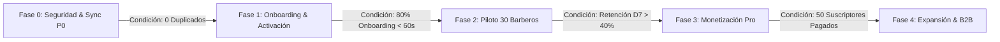

# 🗺️ RegistBar: Roadmap de Producto por Condiciones de Salida

---

## 1. Fases de Evolución Basadas en Criterios de Calidad

---

## 2. Definición Detallada por Fases

### 🛡️ Fase 0: Blindaje Técnico & Seguridad (Semana 1)
* **Objetivo:** Garantizar que la sincronización offline sea matemáticamente inmune a duplicados y que las Edge Functions descuenten cuotas de forma atómica.
* **Condición de Salida:**
  * 100 pruebas de sincronización en red inestable (3G/desconexión abrupta) con **cero registros duplicados** gracias a `client_uuid`.

### 🚀 Fase 1: Activación & Onboarding Progresivo (Semana 2)
* **Objetivo:** Reducir la fricción de entrada para que el barbero registre su primer servicio en menos de 2 minutos tras descargar la app.
* **Condición de Salida:**
  * Al menos el **80% de los nuevos usuarios registra su primer corte en los primeros 3 minutos**.

### 💈 Fase 2: Piloto Controlado con 30 Barberos (Semanas 3 a 6)
* **Objetivo:** Validar el uso diario y la retención en 5 barberías reales de Chile.
* **Condición de Salida:**
  * **Retención Día 7 > 40%** y más de 4 cierres compartidos por WhatsApp por barbero a la semana.

### 💰 Fase 3: Activación de Monetización (Semanas 7 a 10)
* **Objetivo:** Habilitar pasarela de pago (Mercado Pago / Webpay) para el plan Pro de $4.990 CLP/mes.
* **Condición de Salida:**
  * Tasa de conversión de prueba a pago > **8%**.
