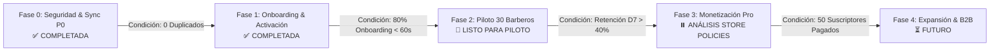

# 🗺️ RegistBar: Roadmap de Producto y Estado de Avance

---

## 1. Fases de Evolución Basadas en Criterios de Calidad

---

## 2. Definición Detallada por Fases y Estado

### 🛡️ Fase 0: Blindaje Técnico & Seguridad — ✅ COMPLETADA
* **Objetivo:** Garantizar que la sincronización offline sea matemáticamente inmune a duplicados y que las Edge Functions descuenten cuotas de forma atómica.
* **Logros:**
  * `client_uuid` e idempotencia con Dexie + Supabase (`OfflineService.ts`).
  * Server-side quota validation en `scan-receipt` Edge Function (límite 5 escaneos gratuitos).

### 🚀 Fase 1: Activación & Onboarding Progresivo — ✅ COMPLETADA
* **Objetivo:** Reducir la fricción de entrada para que el barbero registre su primer servicio en menos de 2 minutos tras descargar la app.
* **Logros:**
  * Onboarding de 3 pasos (`OnboardingChecklist.tsx`).
  * Selector rápido de 1-Tap (`NewServiceModal.tsx`).
  * Instrumentación de telemetría y eventos (`utils/analytics.ts`).

### 💈 Fase 2: Piloto Controlado con 30 Barberos — 🚀 LISTO PARA INICIAR
* **Objetivo:** Validar el uso diario y la retención en barberías reales de Chile.
* **Herramientas Implementadas:**
  * Cierre Semanal y Mensual vía WhatsApp / Compartir nativo (`ReportsView.tsx`).
  * Asesor IA con guardrails de incertidumbre y descargo legal tributario (`fiscal-advisor`).
  * Telemetría de retención y métricas de uso activa (`analytics_events`).

### 💰 Fase 3: Activación de Monetización — ⏸️ POSTERGADO / ANÁLISIS DE TIENDAS
* **Objetivo:** Habilitar pasarela de pago para el plan Pro de $4.990 CLP/mes.
* **Nota de Negocio:** Aplazado al final del roadmap para resolver y cumplir con las políticas de Google Play Store / Apple App Store (In-App Purchases vs Web Checkout externo).
